# Hướng dẫn sử dụng Thunder Client

## 1. Cài đặt

Vào VS code, search **"Thunder Client"**

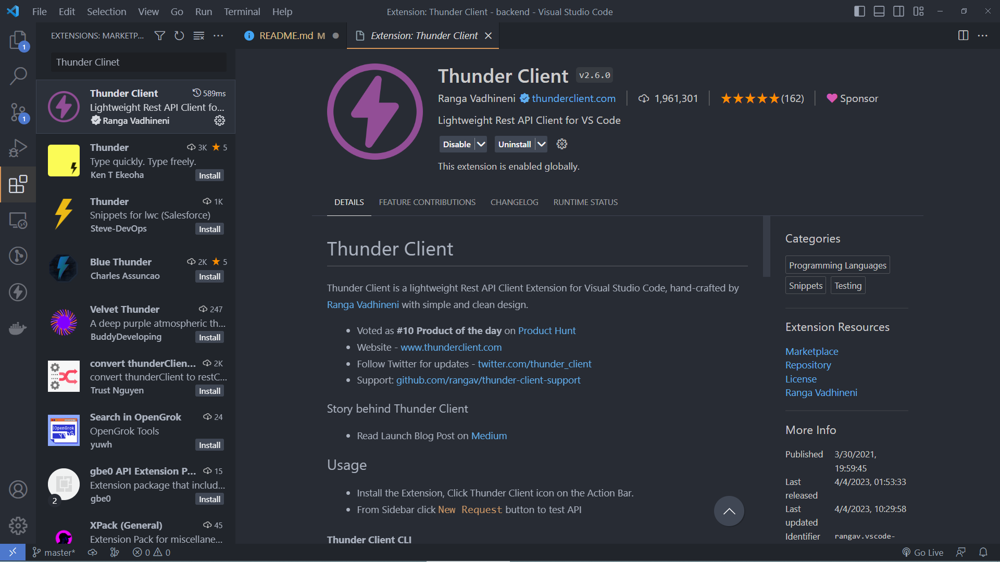

## 2. Sử dụng

### 2.1 Tạo collection

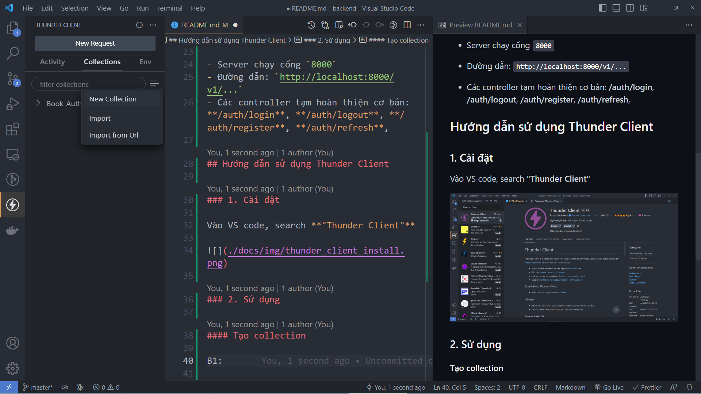

## 2.2 Đặt tên cho collection

VD: Book_Auth

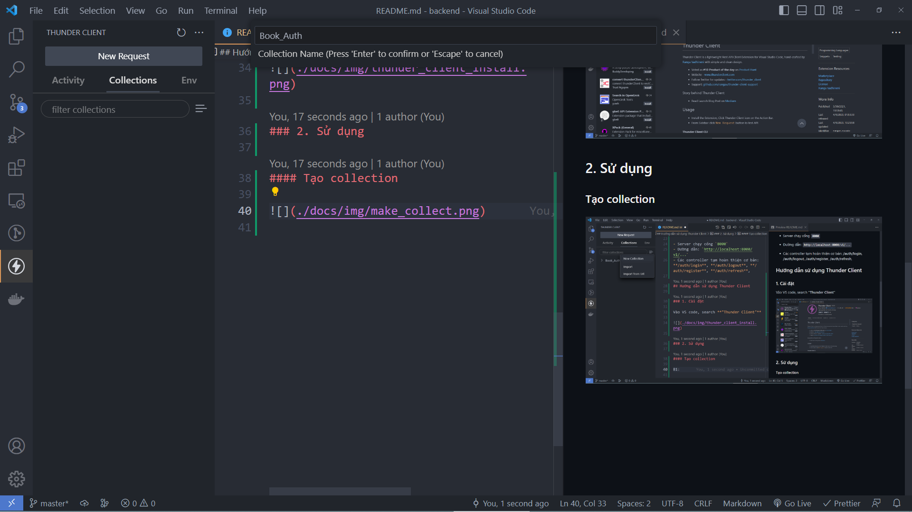

## 2.3 Tạo request mới

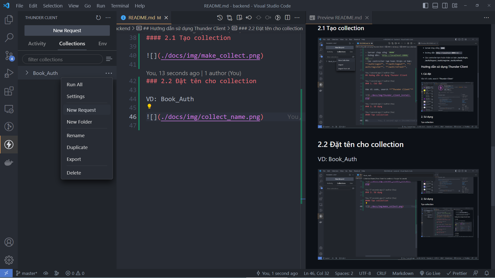

## 2.4 Đặt tên request

VD: Register
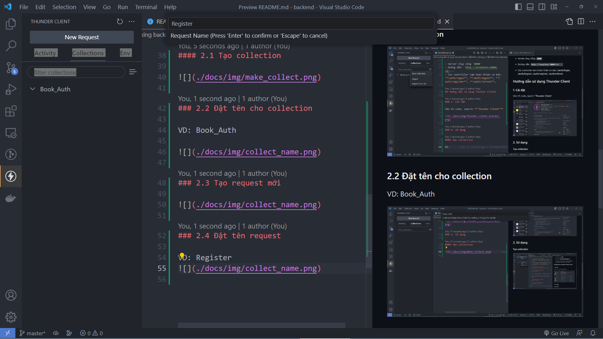

## 2.5 Điền thông tin cho request

VD: Register

-   method: POST
-   url: /v1/auth/register
-   body: Vì register có thông tin về **username** và **password** nên sẽ có phần request body (body không bắt buộc với tất cả các request, thường chỉ có POST request sẽ có body) (định dạng _JSON_)

```json
{
    "usename": "abc4",
    "password": "abc4"
}
```

Sau khi gửi request lên **thành công** thì sẽ có response như sau:

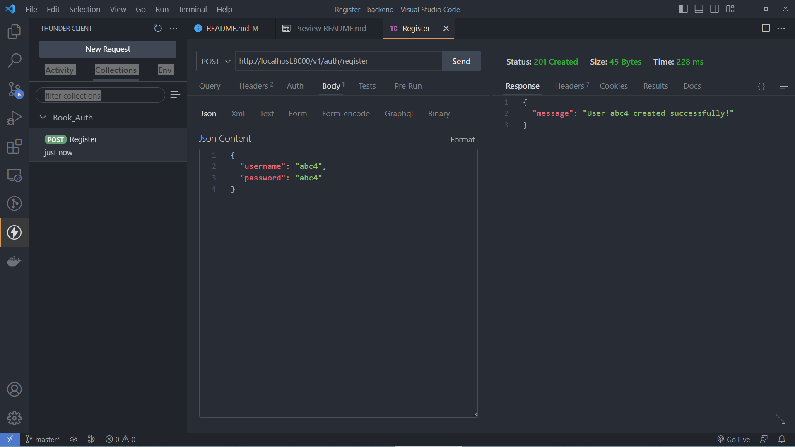

## 2.6 Làm tương tự với các request sau

Login:

-   method: POST
-   url: /v1/auth/login
-   body: Thông tin user vừa register

```json
{
    "usename": "abc4",
    "password": "abc4"
}
```

Sau khi login thành công:
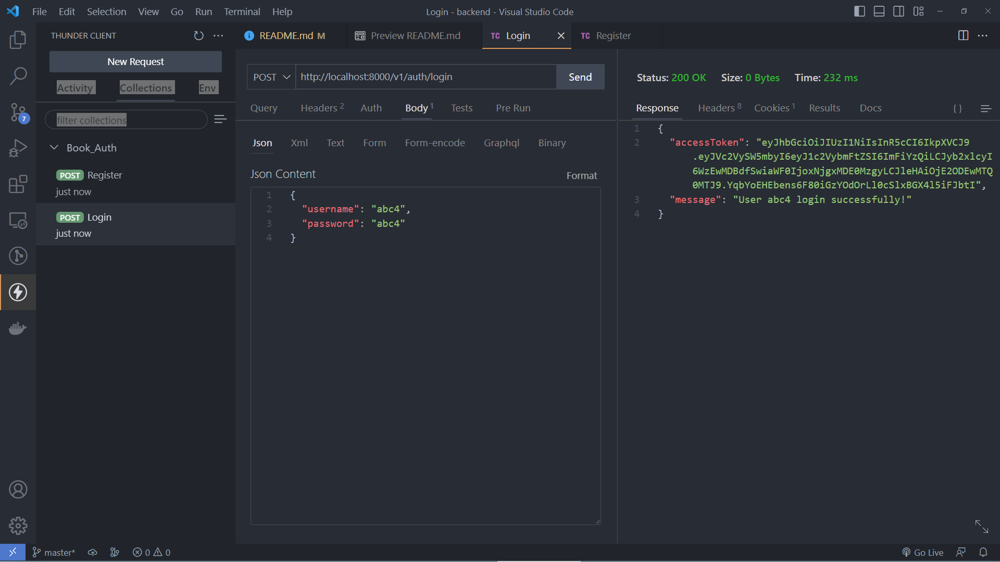

Ngoài ra còn có thêm trả về 1 cookie **'jwt'**

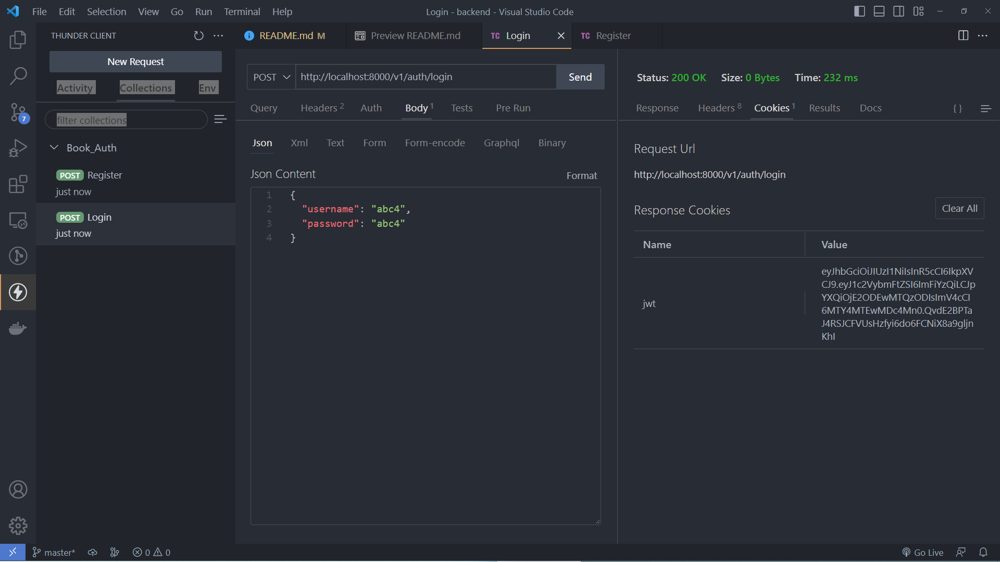

Refresh:

-   method: GET ()
-   url: /v1/auth/refresh
-   body: Không cần
-   Chú ý: **'refresh'** để làm mới accessToken, tuy không cần request body nhưng cần cookie **'jwt'** (trả về khi login thành công). Nếu không có cookie thì sẽ trả về `401`

Sau khi refresh thành công:
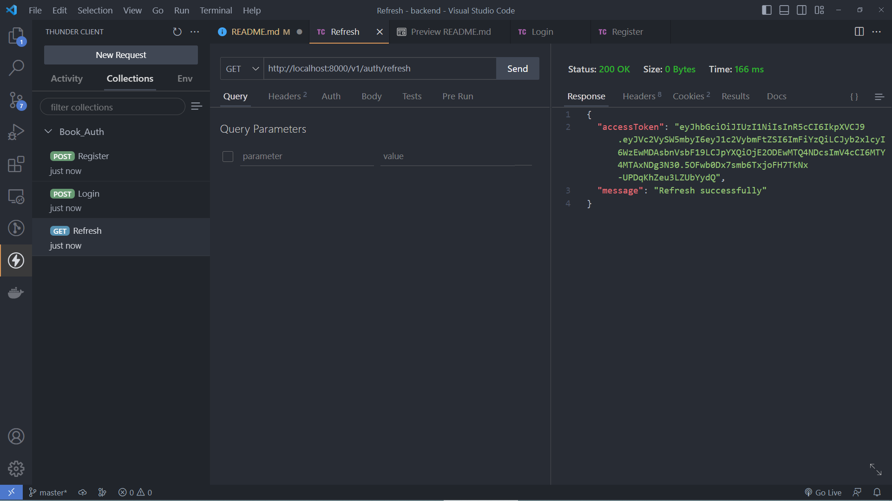

Refresh thành công thì sẽ trả về accessToken mới và cookie **'jwt'** mới

AccessToken mới:


Cookie mới (jwt ở trên là cookie cũ đã bị clear, jwt ở dưới là cookie mới):

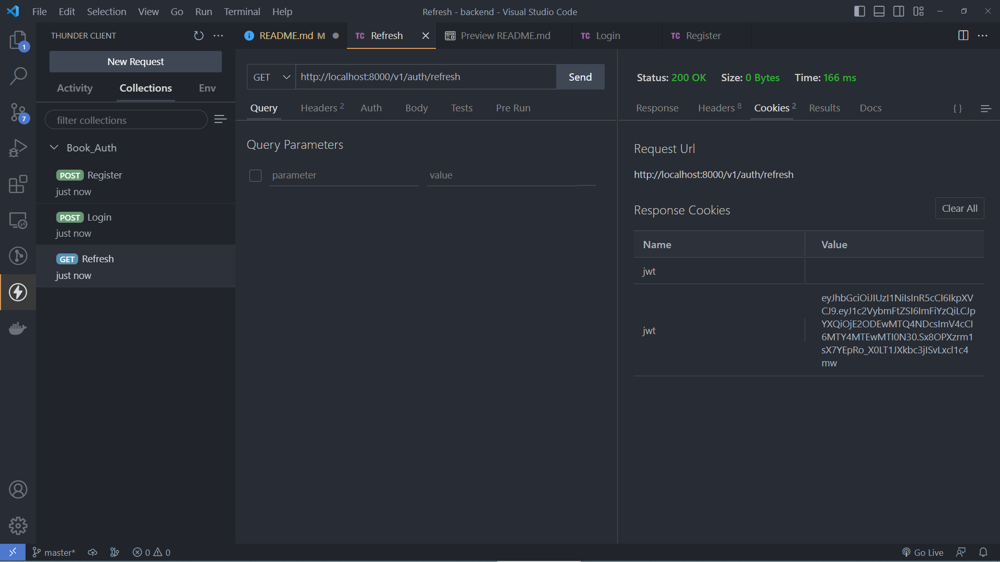

Logout:

-   method: GET
-   url: /v1/auth/logout
-   body: Không cần

Sau khi logout thành công:


Ngoài ra còn clear cookie **'jwt'** nhận được khi login

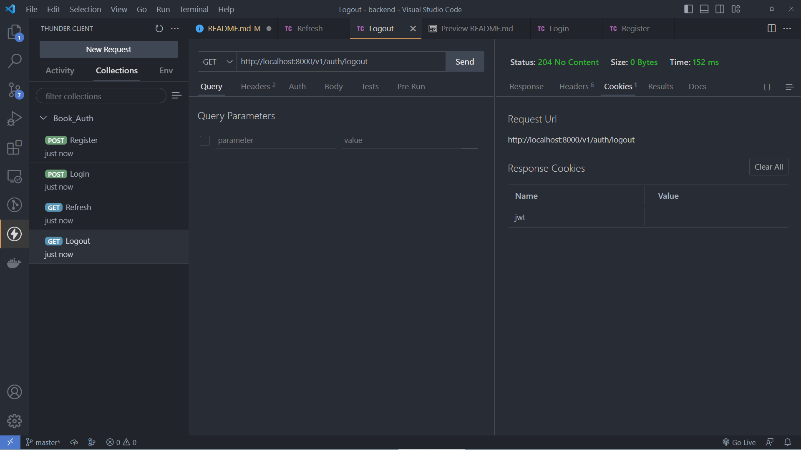
